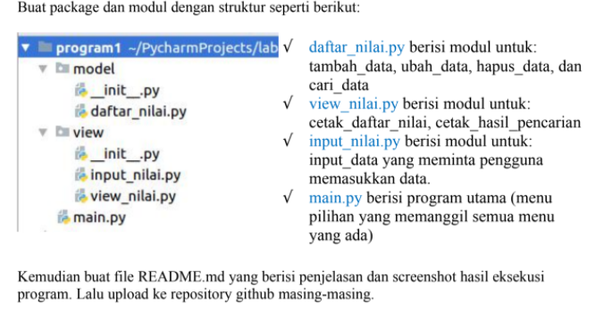
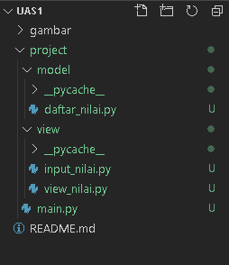
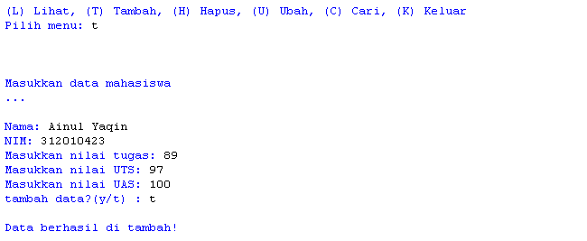
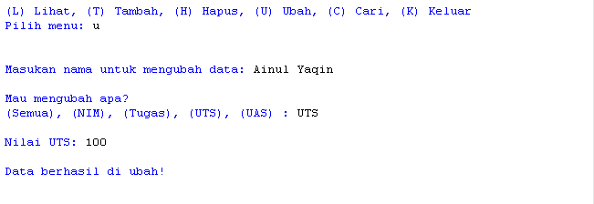
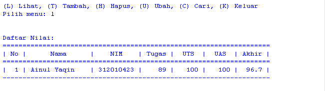
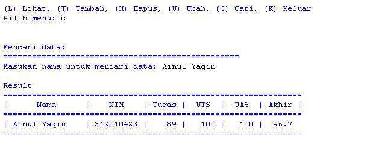
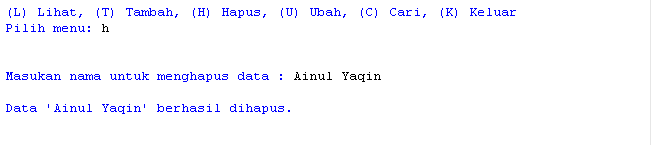

**Nama        : Ainul Yaqin**  
**NIM         : 312010423**  
**Kelas       : TI.20.A.1**  
**Mata Kuliah : Bahasa Pemrograman**  

# Soal  

# Struktur Pekage dan Module  
  
* Terdapat 2 package dengan nama Model dan View  
* Package Model berisi module tambah data, ubah data, hapus data dan cari data  
* Package View berisi module tampilkan  
* Package Controller berisi module core, yang artinya seluruh proses inti melibatkan module core tersebut  
* dan yang terakhir ada module main.py, yang nanti akan di eksekusi  

# Penjelasan

**Controller**  
* `data = {}` untuk menampung list data yang nanti akan terinput  
* Menambahkan fungsi yang nanti nya akan di deklarasikan di setiap module nya, `def input_nama(): def input_nim():` dan yg lainnya, yang nanti akan di masukkan kedalam `data={}`  
* Nilai akhir didapat dari `nilai_akhir = (nilai_tugas)*30/100 + (nilai_uts)*35/100 + (nilai_uas)*35/100`

**Model**  
Tambah data
 * Deklarasikan fungsi `def tambah_data():`  
 * `nama = input("Masukan nama: ")` lalu tambahkan input nama, nim, nilai tugas, uts, uas  
 * `nilai_akhir = (nilai_tugas)*30/100 + (nilai_uts)*35/100 + (nilai_uas)*35/100` untuk nilai akhir diambil dari perhitungan 3 komponen nilai (nilai_tugas: 30%, nilai_uts: 35%, nilai_uas: 35%)  
 * `data[nama] = [nama, nim, nilai_tugas, nilai_uts, nilai_uas, nilai_akhir]` kita akan masukkan data yang tadi kita input ke dalam `data[nama]`  
 * lalu cetak `print()`

Ubah Data
* deklarasikan fungsi `def ubah_data():`  
* `nama = input("Masukan nama untuk mengubah data: ")` kita akan menginput data yang nanti akan di ubah  
* `if nama in data.keys(): print("Mau mengubah apa?")` jika 'nama' dari di dalam 'data' maka akan mengembalikan daftar menggunakan fungsi `keys()` lalu di cetak lah `print()`  
* `sub_data = input("(Semua), (Nama), (NIM), (Tugas), (UTS), (UAS) : ")` membuat menu ubah di dalam `sub_data`  
* `if sub_data.lower() == "semua":` ambil kata kunci 'semua' di dalam sub_data jika 'semua' maka input `data[nama][1] = input("Ubah NIM:") data[nama][2] = int(input("Ubah Nilai Tugas: ")) data[nama][3] = int(input("Ubah Nilai UTS: ")) data[nama][4] = int(input("Ubah Nilai UAS: "))`  
* `data[nama][5] = data[nama][2] *30/100 + data[nama][3]*35/100 + data[nama][4] *35/100` kita dapatkan nilai akhir dengan diambil dari perhitungan 3 komponen nilai (tugas: 30%, uts: 35%, uas: 35%),  
* lalu cetak `print("\nBerhasil ubah data!")`  
* Jika kita ingin mengubah data tertentu maka `elif sub_data.lower() == "nim": data[nama][1] = input("NIM:")` dan berlaku juga untuk nilai tugas, UTS dan UAS  
* lalu cetak `print("\nBerhasil ubah data!")`  
* `else: print("'{}' tidak ditemukan.".format(nama))` jika kita salah dalam memasukkan nama untuk mengubah data maka akan muncul 'nama tidak di temukan'  

Cari Data  
* deklarasikan fungsi `def cari_data():`  
* `if nama in data.keys():` kita mengambil list 'nama' di dalam 'data' menggunakan pengkondisian  
* maka cetak `print("Nama: {0}\nNIM : {1}\nNilai Tugas: {2}\nUTS: {3}\nUAS: {4}\nNilai akhir: {5}"` untuk menampilkan data yang tersedia  
* `else: print("'{}' tidak ditemukan.".format(nama))` jika data yang kita input salah/tidak ditemukan maka akan tercetak 'nama tidak di temukan'  

Hapus Data  
* deklarasikan fungsi `def hapus_data():`  
* `nama = input("Masukan nama untuk menghapus data : ")` kita akan menginput data yang nanti akan di hapus  
* `if nama in data.keys():` kita mengambil list 'nama' di dalam 'data' menggunakan pengkondisian  
* `del data[nama]` hapus semua 'nama' yang ada di dalam 'data'  
* jika sudah maka cetak `print("sub_data '{}' berhasil dihapus.".format(nama))`  
* `else: print("'{}' tidak ditemukan.".format(nama)`) jika data yang kita input salah/tidak ditemukan maka akan tercetak 'nama tidak di temukan'  

**View**  
Lihat Data
* deklarasikan fungsi `def lihat_data():` Kita menggunakan kondisi percabangan if, ambil data dari `data`  
* lalu cetak `print()`  

Yang terakhir eksekusi file main.py

`from controller.core import data`  
`from model.tambah import *`  
`from model.ubah import *`  
`from model.hapus import *`  
`from model.cari import *` 
`from view.tampilkan import *`

`    #print("Sebelum akses program izin dulu sama yang punya :p")`  
`    #break`  

`#Mulai`  
`print("===============================================================")`  
`print("|                     Program Input Nilai                     |")`  
`print("===============================================================")`  

`while True:`  
`    print("\n")`  
`    menu = input("(L) Lihat, (T) Tambah, (H) Hapus, (U) Ubah, (C) Cari, (K) Keluar: ")`  
`    print("\n")`  

`    # menu`  
`    if menu.lower() == 't':`  
`        tambah_data()`  

`    elif menu.lower() == 'c':`  
`        cari_data()`  

`    elif menu.lower() == 'l':`  
`        lihat_data()`  

`    elif menu.lower() == 'u':`  
`        ubah_data()`  

`    elif menu.lower() == 'h':`  
`        hapus_data()`  

`    # Keluar`  
`    elif menu.lower() == 'k':`  
`        break`  

`    else:`  
`        print("Upss ada yang salah, silahkan cek kembali.")`

# Output

Tambah Data  

Ubah Data  

Lihat data  

Cari Data  

hapus data  

# Flowchart  
